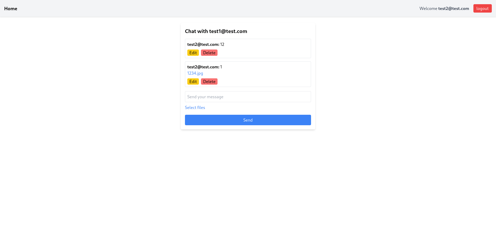

# test app for Meduzzen

This is a test app for Meduzzen


## Table of contents

- [test app for Meduzzen](#test-app-for-meduzzen)
  - [Table of contents](#table-of-contents)
  - [Installation](#installation)
    - [Option 1. Run Locally](#option-1-run-locally)
    - [Option 2. Run on Docker](#option-2-run-on-docker)
  - [Usage](#usage)
  - [Contributing](#contributing)
  - [License](#license)


## Installation

Follow these steps to get started
1. Clone this repository
```bash
git clone https://github.com/Vasya-556/test-app-for-meduzzen.git
cd test-app-for-meduzzen
```
2. Fill .env and backend/.env using .env.example

### Option 1. Run Locally

1. Install dependencies for frontend
```bash 
cd frontend
npm install
```

2. Create python venv in root folder
```bash
python -m venv env
```

3. Install dependencies for backend
```bash
source env/bin/activate # on linux/mac
env\Scripts\activate # on windows
cd backend
pip install -r requirements.txt
```

4. Run
```bash
npm start # in frontend folder
uvicorn main:app --reload # in backend folder
```

### Option 2. Run on Docker

1. Build and start the containers
```bash
docker compose up --build
```

## Usage
- Open the app at `http://localhost:3000`.  
- Sign up/ sign in
- Select another user to chat
- Send your messages, files, edit them, etc
- Logout

## Contributing

Pull requests are welcome.

## License

[MIT](LICENSE)